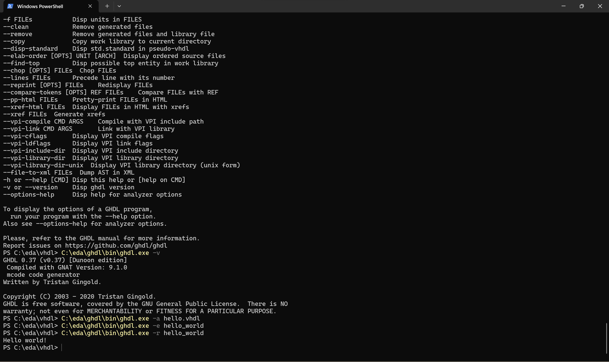
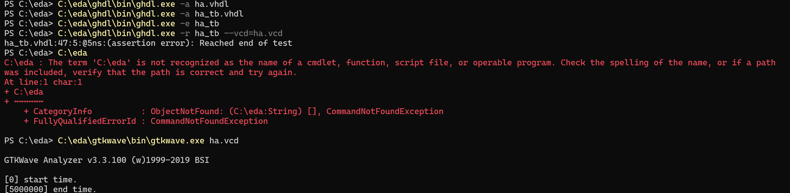
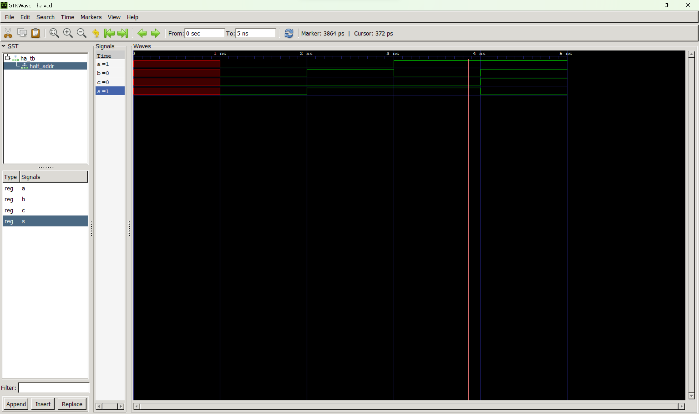
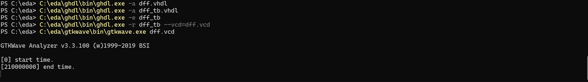
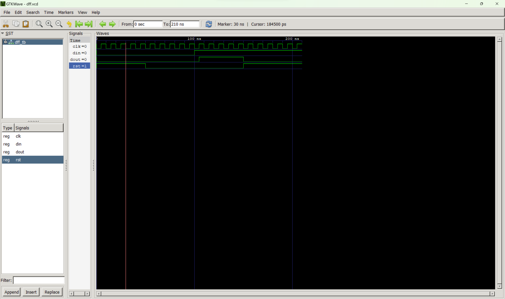

Due to my inexperience with using a terminal, I first ran the hello world executable file to ensure I had set everything up correctly. The -h flag was useful in gaining a general understanding of what I was doing.

A half adder is a logic circuit that adds two single digit binary numbers. Here are my gtk wave results for the half adder:

A Digital Flip Flop is useful when we want to store data based on clocking. In this example, dout is supposed to change to the signal of din any time the voltage of the clock goes high. At 100ns, we see that the din signal goes high. Thus, dout also goes high on the next rising edge of the clock. However, at 150ms, dout goes low despite din remaining high. The reason for this change is the rst input, which goes to one and tells dout to go to zero.

