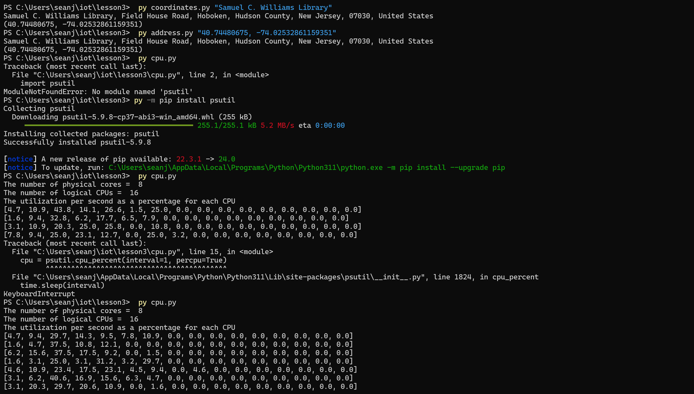
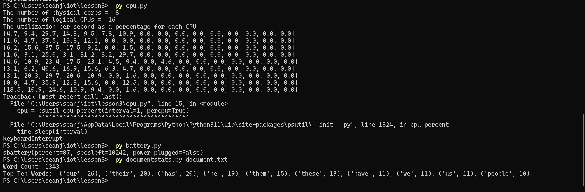

The image below shows the following:
- Calendar and Julian Calendar dates
- Date
- Date and Time

This image shows:
- This day's Dawn, sunrise, noon, sunset and dusk times (I never knew that dawn and sunrise were different things)
- Moon phase of current and following days

The final two images show:
- Coordinates and adress
- CPU usage
- Battery data
- The top 10 words in a document

